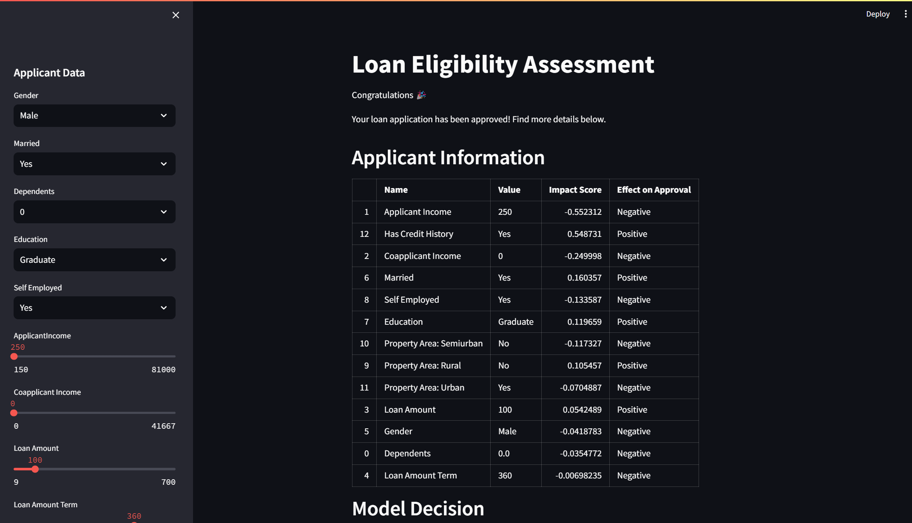
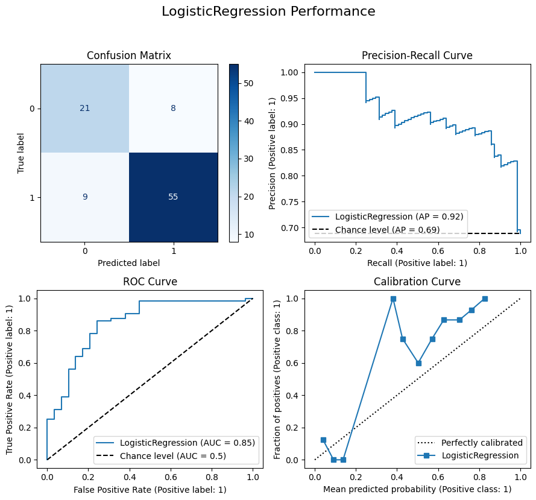
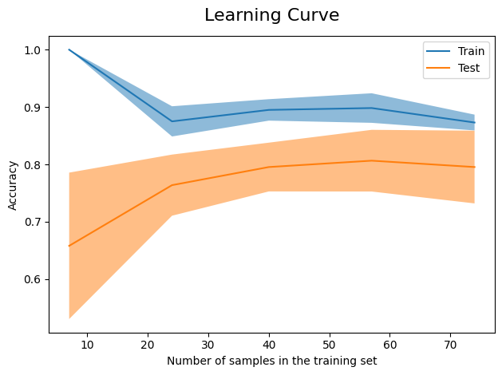

# A trust-worthy model for loan eligibility assessment

In this project, I built a machine learning model to assess if an applicant is eligible for a loan or not, then I used GPT-3.5 to generate a report explaining in details the model's decision to a loan's officer. 

## TL;DR
- Test the app at: https://loan-eligibility.streamlit.app/.
- Find an example of generated report for a loan application in the [reports](reports) folder.

## GUI

The GUI was built using [Streamlit](https://streamlit.io/).




Let me take you through the steps of this project.

## Situation

Loan officiers manually look at loan applications and decide if the applicant is eligible for a loan or not. This process is time-consuming and prone to human biases. Machine Learning can help automate this process and make it more fair and efficient.

However, since we are dealing with humans, a few questions arise:
- How can we make sure that the model is not discriminating against any group of people?
- How can we make sure that the model is trust-worthy?

Therefore, model's interpretability is at the core of this project.

## Analysis 

ML algorithms are powerful as they can capture complex relationships in the data.

**Pros and cons**

&nbsp;&nbsp;&nbsp;&nbsp; ✅ Smarter, more accurate, capture complex relationships \
&nbsp;&nbsp;&nbsp;&nbsp; ❌ More complex, harder to implement, explainability is not straightforward

## Action

Now how do we proceed?

To solve this problem using machine learning, we can follow these steps:

- Data preparation: we will use [Pandas](https://pandas.pydata.org/) for this.
- Automated model selection: we will use the [multivariate TPE](https://tech.preferred.jp/en/blog/multivariate-tpe-makes-optuna-even-more-powerful/) to select and optmize the best model in the most efficient way. [Optuna](https://optuna.org/) is a great library for this.
- Interpretability: we will use SHAP Values as they provide an intuitive way to explain the model's logic. The [shap](https://shap.readthedocs.io/en/latest/) library provides a great implementation of this.
- Reporting: we will use [GPT-3.5](https://platform.openai.com/docs/models) to generate a report explaining the model's decision.

## Results

It turns out a simple logistic regression model achieved the best performance with no hyperparameters tuning.

### Classification report

While the model achieved an accuracy of 80%, it rejected some applications that should have been approved, which explains its low precision on the "Rejected" class and lower recall on the "Approved" class.


```
              precision    recall  f1-score   support

    Rejected       0.72      0.70      0.71        30
    Approved       0.86      0.87      0.87        63

    accuracy                           0.82        93
   macro avg       0.79      0.79      0.79        93
weighted avg       0.82      0.82      0.82        93
```

### Model performance

These graphs look good, except for the calibration curve which shows that the model is not well calibrated for probabilities between 0.2 and 0.5.




## Potential improvements

### Adding more data

The learning curve shows that the accuracy of the model decreases as we add more training data, whereas the accuracy of the validation is low at the beginning and increases as we add more training data. This indicates that adding more data improves the generalization capability of the model and therefore, more quality data could potentially improve the model.



### Feature engineering

Some experiments were conducted by creating new features from the existing ones:
- Monthly Payment: Monthly payment for the loan
- Total Income: The sum of applicant and co-applicant income
- Amount Income Ratio: The ratio between the monthly payment and the total income
- Amount Income Ratio Percent: The ratio between the monthly payment and the total income, mapped between 0 and 1.

However, these features did not have any impact on the model's performance.

Feature engineering could be investigated further to improve the model's performance.


## References

- Dataset: https://www.kaggle.com/datasets/devzohaib/eligibility-prediction-for-loan
